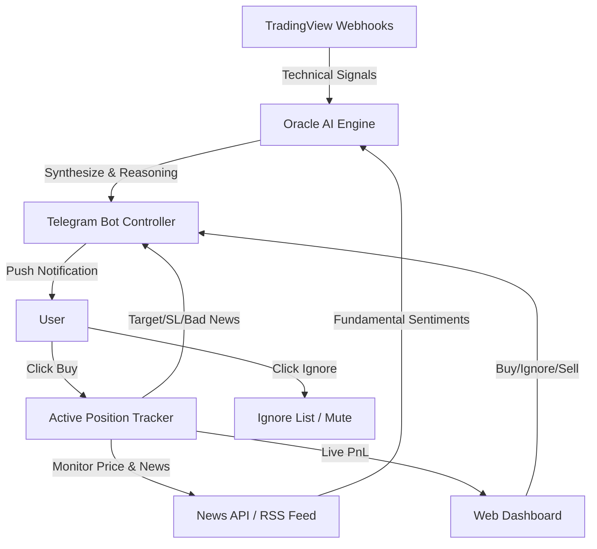

# Project Oracle - Architecture Blueprint (Stock Pivot)

## 1. Tujuan Sistem
Project Oracle telah melakukan pivot menjadi sistem *Telegram-Driven Stock Signal Engine*. Sistem ini ditujukan untuk pasar saham (lokal maupun internasional) dengan pendekatan semi-otomatis melalui Telegram.

Prinsip utama sistem yang baru:
- **Reason-Based Signals**: Setiap sinyal harus dilengkapi dengan penjelasan atau *reason* dari AI (Gemini).
- **Fundamental + Technical Confluence**: Sinyal teknikal wajib diverifikasi dengan kondisi berita fundamental terkini.
- **Telegram Controller**: Eksekusi keputusan akhir (Beli/Abaikan) dilakukan manual oleh user via Telegram Bot, tidak ada auto-trade eksekusi ke broker.
- **Active Tracking**: Jika *user* memutuskan untuk "Beli", sistem akan memantau harga dan berita untuk memberikan alert pergerakan anomali.

## 2. Arsitektur Tingkat Tinggi

## 3. Komponen Utama

### 3.1 Data Ingestion Layer
Tugas:
- Menerima webhook alert dari indikator TradingView (misal: MA Crossover, Breakout Support/Resistance).
- Mengambil berita terbaru dari sumber eksternal (NewsAPI, Yahoo Finance, dll) secara *on-demand* ketika sinyal teknikal masuk.
- Mengambil data harga terkini via yfinance untuk analisa teknikal otomatis.

### 3.2 Oracle AI Engine (Gemini 2.5 Pro + Quantitative Modules)
Tugas:
- Mengambil 1 tahun data harga harian via yfinance (untuk dukungan indikator 200 bar).
- Menjalankan **Quantitative Analysis Pipeline** secara otomatis:
  1. **Structure Engine** — Deteksi market regime (uptrend/downtrend/chop).
  2. **Zone Engine** — Deteksi zona supply/demand berdasarkan struktur pasar.
  3. **Confluence Engine** — Scoring confluence menggunakan Fibonacci 0.618 retracement.
  4. **Pullback Strategy** — Identifikasi Golden Pullback dan Silent Pullback (EMA200, MA99, Bollinger, Bullish Pinbar, Volume Anomaly).
  5. **Sniper Entry** — Menghitung entry price, stop loss, dan take profit secara matematis dari confluence dan zone.
- Hasil quantitative dikirim sebagai **konteks tambahan** ke Gemini AI bersama data harga dan berita.
- AI mensintesis semua data untuk keputusan final (BUY/SELL/IGNORE).
- Jika quantitative entry plan valid DAN AI setuju BUY, **price levels dari quantitative digunakan** (lebih akurat secara matematis).
- Contoh output: "Valid Buy. AAPL Golden Pullback confirmed di confluence 85/100, didukung oleh laporan laba Q3 positif."

### 3.3 Telegram Bot Controller
Tugas:
- Mengirim pesan dengan format yang jelas:
  - **Ticker**: Saham yang dipantau.
  - **Status**: BUY/SELL/IGNORE.
  - **Reasoning**: Justifikasi dari AI.
  - **Price Levels**: Entry, Target, Stop Loss.
  - **Data Timestamp**: Kapan data harga diambil (intraday vs last close).
  - **Expiry Info**: Berapa lama signal valid (default 24 jam).
  - **Action Buttons**: Inline keyboard `[Beli]` dan `[Abaikan]`.

### 3.4 Signal Lifecycle Management
Setiap signal memiliki lifecycle:
1. **PENDING**: Baru dibuat, menunggu aksi user (max 24 jam).
2. **TRACKING (BUY)**: User klik Beli → masuk Active Portfolio.
3. **IGNORED**: User klik Abaikan → ticker dimute 3 hari.
4. **EXPIRED**: 24 jam tanpa aksi → otomatis kadaluarsa.

Anti-spam guards:
- Ticker yang sedang TRACKING tidak akan dianalisa ulang.
- Ticker yang sedang IGNORED tidak akan dianalisa ulang.
- Ticker yang sudah punya signal PENDING tidak akan dianalisa ulang.
- Maksimal 1 analisa per ticker per hari.

### 3.5 Position Tracker & Sell Signal
Tugas:
- **Price Monitoring**: Cek harga terkini via yfinance setiap cycle.
  - Jika harga >= target → Alert "Target Reached"
  - Jika harga <= stop loss → Alert "Stop Loss Hit"
- **News Monitoring**: Cek berita terkini via Yahoo RSS.
  - Jika ada berita sangat buruk → Alert "Emergency Sell"
- **Live PnL**: Update current_price dan pnl_percent di database setiap cycle.
- **Sell Signal**: HANYA dikirim untuk saham yang sudah dibeli (ada di Active Portfolio).

### 3.6 Web Dashboard
Tiga tampilan utama:
1. **Pending Signals**: Signal BUY/SELL baru yang belum di-act, dengan countdown expiry.
2. **Active Portfolio**: Tabel monitoring posisi aktif (entry, current, target, SL, PnL, close button).
3. **Signal History**: Riwayat signal yang sudah resolved/expired.

## 4. Teknologi & Deployment

Karena sistem sudah dalam posisi *deployed*, penyesuaian teknologi adalah sebagai berikut:

- **Backend (GCP - Singapore)**:
  - Menggunakan arsitektur Python yang sudah ada (`src/main.py`, `src/api`).
  - Harus dimodifikasi untuk *listen* webhook dari Telegram dan TradingView.
  - Berperan sebagai pusat logika *tracker* dan integrasi ke Gemini API serta News API.
- **Frontend (Vercel)**:
  - Berfungsi sebagai *dashboard viewer* untuk memantau status `Active Tracking`, log history Telegram bot, dan pengaturan parameter AI.
- **Database**:
  - PostgreSQL (untuk menyimpan daftar *Active Tracking*, *Ignore List*, dan *History Trade/Log*).
  - Redis (opsional, untuk caching sentimen berita per *ticker* agar mengurangi request API).

## 5. Roadmap Pivot
- **Phase 1: Telegram & Webhook Foundation** ✅
  - Setup webhook penerima dari TradingView.
  - Setup integrasi pengirim pesan ke Telegram Bot.
- **Phase 2: AI Reasoning Integration** ✅
  - Implementasi *fetcher* berita (Free News API).
  - Integrasi prompt Gemini API untuk mensintesis data teknikal dan berita menjadi *Reasoning text*.
- **Phase 3: Interactive Tracking** ✅
  - Implementasi *Telegram Inline Keyboard* callback (Beli/Abaikan).
  - Pembuatan *database schema* untuk tracker posisi.
- **Phase 4: Alerting Anomaly** ✅
  - *Cron scheduler* di backend untuk mengecek berita buruk mendadak pada saham di daftar *Active Tracking*.
  - Push notifikasi darurat.
- **Phase 5: Signal Lifecycle & Portfolio** ✅
  - Signal expiry (24 jam auto-expire).
  - Anti-spam & deduplication guards.
  - Price-based sell signals (target reached, stop loss hit).
  - Live portfolio monitoring with PnL.
  - Multi-table web dashboard (Pending, Portfolio, History).
  - Data timestamp awareness (intraday vs last close).
