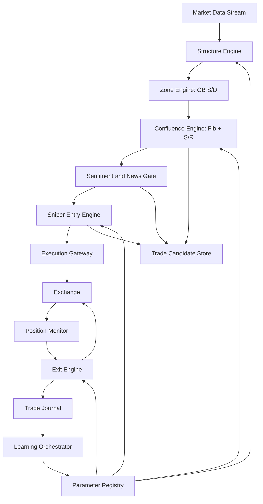
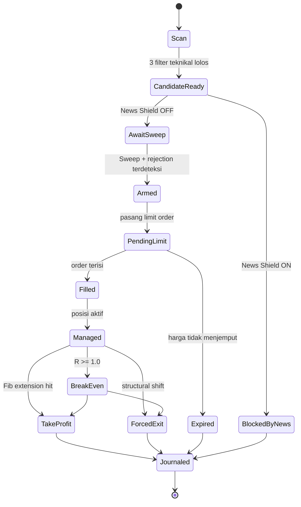

# Project Oracle - Architecture Blueprint

## 1. Tujuan Sistem
Project Oracle adalah trading automation platform untuk high-risk execution (hingga leverage 50x) dengan prinsip:
- masuk trade hanya saat confluence sangat kuat
- batalkan setup teknikal jika konteks sentimen/berita berbahaya
- pertahankan modal lewat risk control yang agresif
- belajar dari kegagalan secara berkala

Filosofi utama: The Filter Funnel. Setup hanya valid jika lolos semua filter.

## 2. Prinsip Desain
- Safety over frequency: lebih baik sedikit entry, tapi berkualitas.
- Event-driven: setiap sinyal teknikal, sentimen, dan risk diproses sebagai event.
- Vendor-agnostic AI: provider sentimen/berita dipasang lewat adapter agar tidak lock-in.
- Explainable trade decisions: setiap keputusan punya reason code yang bisa diaudit.
- Progressive autonomy: fase awal hanya tuning parameter, bukan self-modifying code otomatis.

## 3. Arsitektur Tingkat Tinggi

## 4. Komponen Utama

### 4.1 Structure Engine (Filter 1 - The Compass)
Tugas:
- identifikasi regime: uptrend, downtrend, atau chop
- validasi pola HH/HL untuk bullish dan LH/LL untuk bearish
- lock trading bila regime tidak jelas (sleep mode)

Output:
- market_regime
- structure_strength_score
- invalidation_level

### 4.2 Zone Engine (Filter 2 - The Battlefield)
Tugas:
- deteksi supply/demand zone
- identifikasi order block (candle terakhir sebelum impuls)
- tunggu harga kembali ke zona, tidak entry di tengah pergerakan

Output:
- active_order_blocks
- zone_freshness_score
- zone_type (demand/supply)

### 4.3 Confluence Engine (Filter 3 - The Precision)
Tugas:
- tarik Fibonacci retracement pada swing valid
- hitung golden zone (utama 0.618, opsional 0.705)
- cek overlap dengan support/resistance klasik + order block

Output:
- confluence_score
- confluence_cluster_price
- setup_valid_until

### 4.4 Sentiment and News Gate (The Grok Instinct)
Tugas:
- query sentimen real-time (contoh sumber: X)
- klasifikasi emosi pasar: fear/neutral/greed
- deteksi kata kunci high-risk (hack, lawsuit, CPI release, SEC action)
- aktifkan news shield untuk membatalkan setup teknikal saat kondisi chaos

Output:
- sentiment_bias (bullish/bearish/neutral)
- event_risk_level (low/medium/high)
- shield_status (on/off)

Catatan desain:
- gunakan interface provider, contoh: SentimentProvider dan NewsProvider
- implementasi awal bisa GrokAdapter, tapi sistem tidak bergantung satu vendor

### 4.5 Sniper Entry Engine (50x Survival)
Tugas:
- hanya limit order, tanpa market chasing
- validasi liquidity sweep (sweep -> rejection -> reclaim zone)
- trigger entry saat harga kembali masuk zona setelah rejection yang sah
- enforce max slippage, spread limit, dan max concurrent exposure

Output:
- entry_order_plan
- stop_loss_price
- position_size

### 4.6 Exit Engine
Tugas:
- auto move stop ke breakeven saat R mencapai 1.0
- target objektif pakai Fibonacci extension (1.272 atau 1.618)
- emergency exit saat structural shift melawan posisi

Output:
- exit_signal_type (tp, be, structural_shift, timeout)
- close_plan

### 4.7 Learning Orchestrator (Self-Evolution)
Tugas:
- ambil 10 trade terburuk tiap minggu
- kirim paket data ke AI Analyst
- terima insight berbasis pola gagal
- usulkan update parameter ke Parameter Registry

Guardrail:
- perubahan parameter wajib melewati approval policy
- jangan auto-deploy perubahan tanpa shadow validation

## 5. Trade Lifecycle State Machine

## 6. Risk Management Layer
- Hard risk per trade: maksimum 0.5% sampai 1.0% ekuitas.
- Daily loss cap: misalnya 2% ekuitas, lalu sistem lock hingga hari berikutnya.
- Max open positions: batasi korelasi antar aset.
- Kill switch global: manual + otomatis saat latency/exchange error tinggi.
- Circuit breaker:
  - consecutive_loss_limit
  - abnormal_spread_limit
  - data_staleness_limit

## 7. Data and Storage Strategy
- PostgreSQL:
  - source of truth untuk trade journal, setup snapshot, keputusan AI, audit trail
- Redis:
  - cache market context, lock distributed job, rate limit, short-lived candidate state

Minimal retention:
- raw market feature: 30-90 hari (sesuai biaya)
- trade journal + audit log: 2 tahun
- parameter change history: permanen

## 8. Security and Compliance Baseline
- API key exchange dan AI provider wajib di secret manager/env, tidak di source code.
- Semua keputusan order wajib punya idempotency key.
- Semua aksi kritikal dicatat dengan correlation_id.
- Role separation:
  - strategy_admin
  - ops_observer
  - execution_service

## 9. Deployment Topology (MVP)
- service-1: market-ingestor
- service-2: strategy-engine (filter + sniper + exit)
- service-3: sentiment-gateway
- service-4: execution-gateway
- service-5: learning-orchestrator (scheduled)
- infra: postgres, redis, message broker

MVP dapat dimulai sebagai modular monolith, lalu dipisah jadi service saat beban meningkat.

## 10. Roadmap Implementasi
- Phase 0: docs + risk policy + schema
- Phase 1: technical filters + paper trading
- Phase 2: sentiment/news gate + shield
- Phase 3: live execution kecil + hard circuit breaker
- Phase 4: weekly learning loop + semi-automated parameter tuning
- Phase 5: multi-asset orchestration + dashboard governance

## 11. Definition of Done untuk Fase Coding Pertama
- aturan Filter Funnel berjalan end-to-end di mode paper
- semua entry punya reason code dan screenshot/snapshot data
- exit logic (BE, fib TP, structural shift) tervalidasi di backtest dan replay
- laporan mingguan 10 trade terburuk otomatis tersedia
