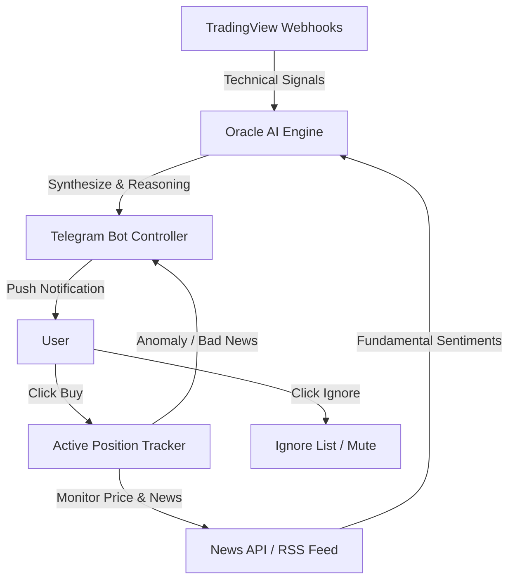

# Project Oracle - Architecture Blueprint (Stock Pivot)

## 1. Tujuan Sistem
Project Oracle telah melakukan pivot menjadi sistem *Telegram-Driven Stock Signal Engine*. Sistem ini ditujukan untuk pasar saham (lokal maupun internasional) dengan pendekatan semi-otomatis melalui Telegram.

Prinsip utama sistem yang baru:
- **Reason-Based Signals**: Setiap sinyal harus dilengkapi dengan penjelasan atau *reason* dari AI (Gemini).
- **Fundamental + Technical Confluence**: Sinyal teknikal wajib diverifikasi dengan kondisi berita fundamental terkini.
- **Telegram Controller**: Eksekusi keputusan akhir (Beli/Abaikan) dilakukan manual oleh user via Telegram Bot, tidak ada auto-trade eksekusi ke broker.
- **Active Tracking**: Jika *user* memutuskan untuk "Beli", sistem akan memantau harga dan berita untuk memberikan alert pergerakan anomali.

## 2. Arsitektur Tingkat Tinggi

## 3. Komponen Utama

### 3.1 Data Ingestion Layer
Tugas:
- Menerima webhook alert dari indikator TradingView (misal: MA Crossover, Breakout Support/Resistance).
- Mengambil berita terbaru dari sumber eksternal (NewsAPI, Yahoo Finance, dll) secara *on-demand* ketika sinyal teknikal masuk.

### 3.2 Oracle AI Engine (Gemini 3.1 Pro)
Tugas:
- Menerima data teknikal (contoh: "Ticker AAPL Breakout Resistance $180").
- Mencari konteks berita terbaru terkait AAPL.
- Membuat sintesis dan justifikasi (reason).
- Contoh output: "Valid Buy. AAPL breakout didukung oleh laporan laba Q3 yang mengalahkan ekspektasi pasar." atau "Abaikan. Walau teknikal breakout, terdapat investigasi antitrust terbaru."

### 3.3 Telegram Bot Controller
Tugas:
- Mengirim pesan dengan format yang jelas:
  - **Ticker**: Saham yang dipantau.
  - **Status**: BUY/IGNORE.
  - **Reasoning**: Justifikasi dari AI.
  - **Action Buttons**: Inline keyboard `[Beli]` dan `[Abaikan]`.

### 3.4 Position Tracker & State Management
Tugas:
- **State [Beli]**: Saham masuk ke *Active Tracking Database*. Sistem menjalankan *cron job* untuk memeriksa pergerakan harga atau jika ada *breaking bad news*. Jika target harga menyimpang atau berita berubah buruk secara drastis, *push alert* "Urgent Sell" ke Telegram.
- **State [Abaikan]**: Saham dimasukkan ke *Cooldown/Ignore List* selama beberapa waktu (misal 3-5 hari) agar user tidak menerima *spam* untuk emiten yang sama.

## 4. Teknologi & Deployment

Karena sistem sudah dalam posisi *deployed*, penyesuaian teknologi adalah sebagai berikut:

- **Backend (GCP - Singapore)**: 
  - Menggunakan arsitektur Python yang sudah ada (`src/main.py`, `src/api`).
  - Harus dimodifikasi untuk *listen* webhook dari Telegram dan TradingView.
  - Berperan sebagai pusat logika *tracker* dan integrasi ke Gemini API serta News API.
- **Frontend (Vercel)**:
  - Berfungsi sebagai *dashboard viewer* untuk memantau status `Active Tracking`, log history Telegram bot, dan pengaturan parameter AI.
- **Database**:
  - PostgreSQL (untuk menyimpan daftar *Active Tracking*, *Ignore List*, dan *History Trade/Log*).
  - Redis (opsional, untuk caching sentimen berita per *ticker* agar mengurangi request API).

## 5. Roadmap Pivot
- **Phase 1: Telegram & Webhook Foundation**
  - Setup webhook penerima dari TradingView.
  - Setup integrasi pengirim pesan ke Telegram Bot.
- **Phase 2: AI Reasoning Integration**
  - Implementasi *fetcher* berita (Free News API).
  - Integrasi prompt Gemini API untuk mensintesis data teknikal dan berita menjadi *Reasoning text*.
- **Phase 3: Interactive Tracking**
  - Implementasi *Telegram Inline Keyboard* callback (Beli/Abaikan).
  - Pembuatan *database schema* untuk tracker posisi.
- **Phase 4: Alerting Anomaly**
  - *Cron scheduler* di backend untuk mengecek berita buruk mendadak pada saham di daftar *Active Tracking*.
  - Push notifikasi darurat.
